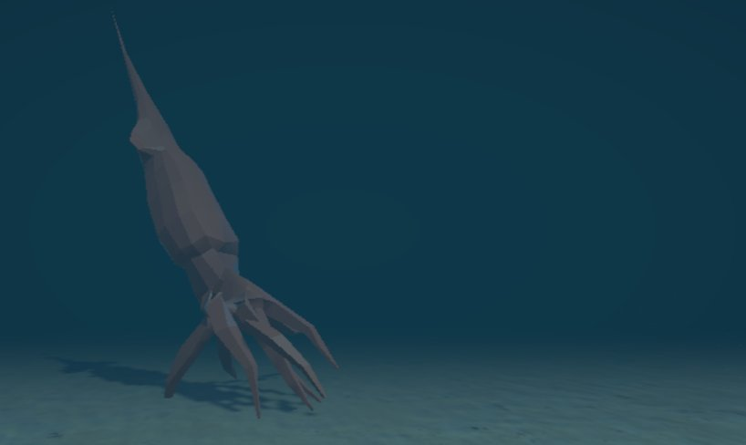
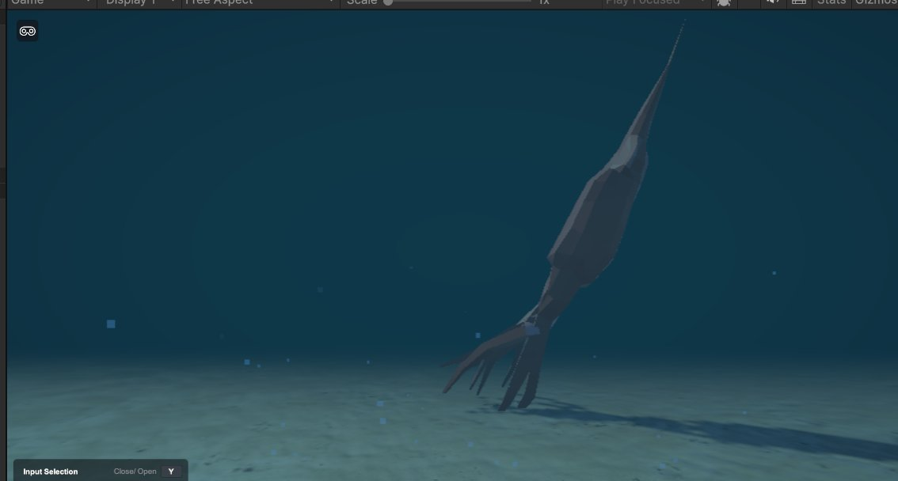
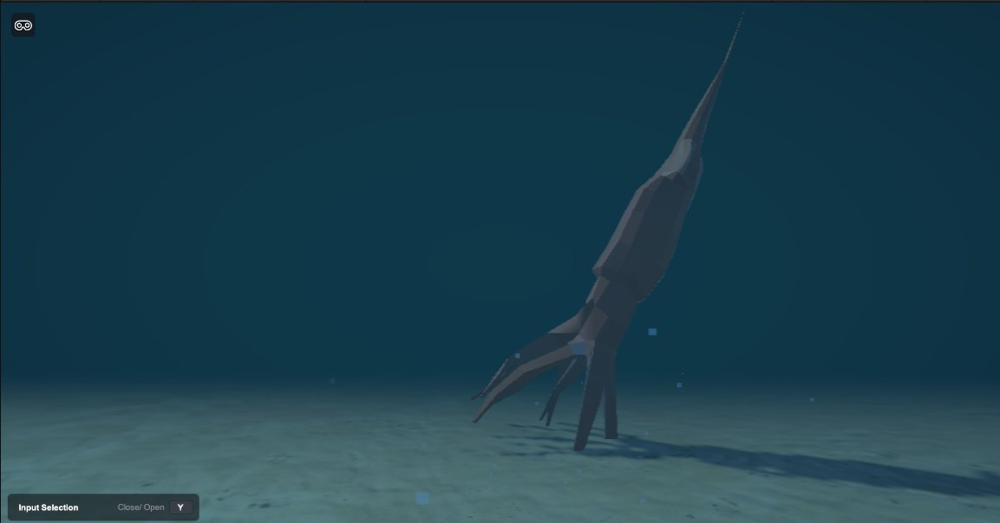
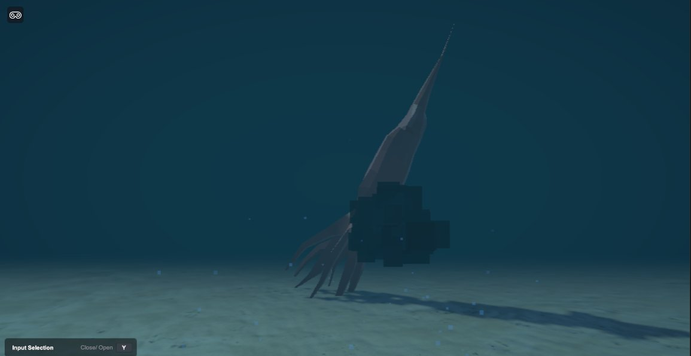

<div align="center">

#  Squid Interaction

### Place a living ocean floor in your real world

**Point your phone at any floor. Tap once. Watch a giant squid emerge from the deep — surrounded by drifting bubbles and underwater fog .**

<br/>

[](https://unity.com)
[](https://docs.unity3d.com/Packages/com.unity.xr.arfoundation@6.0)
[](https://developer.android.com)
[](LICENSE)
[](https://github.com/sahith-ch/Squid-Interaction/stargazers)

<br/>

</div>

---

## 📸 Screenshots

<div align="center">

| | |
|:---:|:---:|
|  |  |
| *Low-poly giant squid on the ocean floor* | *Bubbles drifting upward, teal depth fog* |
|  |  |
| *Walking around the squid in AR* | *Tapping the triggers ink animation* |

</div>

>
> 
> 

---

## 🎯 What is this?

Squid Interaction is a **markerless AR experience** built with Unity 6.3 LTS and ARFoundation 6. There are no QR codes, no image targets — just your phone camera and a flat floor.

The app scans your real-world floor using ARCore, lets you tap to place an ocean scene, and locks it to that physical spot so it stays there as you walk around it. The underwater atmosphere — fog, bubbles, post processing — all activates the moment you place.

---

## ✨ Features

| | Feature | Description |
|---|---|---|
| 🔍 | **Markerless floor detection** | ARFoundation scans horizontal surfaces in real time — no setup needed |
| 👆 | **One-tap placement** | Tap any detected surface to anchor the ocean scene |
| 🦑 | **Low-poly giant squid** | Fully rigged, animated, offset 3m in front of your tap point |
| 💧 | **Underwater post processing** | URP volume activates on placement — colour grading, depth of field |
| 🫧 | **Procedural bubbles** | Particle system built at runtime, parented to the ocean floor |
| 🌫️ | **Exponential depth fog** | Deep teal fog fills the space and fades distant objects |
| 🔁 | **Reset and rescan** | Return to scanning mode and replace the scene anywhere |

---

## 📲 Try It — Install the APK

> **Android only.** Requires ARCore support — [check your device here](https://developers.google.com/ar/devices).

<div align="center">


</div>

**1. Download** — tap the button above on your Android phone

**2. Allow unknown sources**
```
Settings → Apps → Special App Access → Install Unknown Apps
→ select your browser → toggle Allow
```

**3. Install** — open the downloaded `.apk` and tap **Install**

**4. Allow camera** — tap **Allow** when prompted (required for AR)

**5. Scan your floor** — move the phone slowly over any flat floor until a dashed outline appears

**6. Tap to place** — tap the outline and watch the ocean appear 🌊

---

## 🛠️ Build From Source

### Prerequisites

| Tool | Version | Notes |
|---|---|---|
| [Unity Hub](https://unity.com/download) | Latest | — |
| Unity Editor | **6.3 LTS** | Install via Hub |
| Android Build Support | — | Add via Hub → Modules |
| Android SDK + NDK + JDK | — | Add via Hub → Modules |
| Physical Android device | ARCore supported | Editor uses simulation |

### Steps

**1. Clone**
```bash
git clone https://github.com/sahith-ch/Squid-Interaction.git
```
Open **Unity Hub → Open → Add project from disk** → select the cloned folder.

**2. Switch platform**

File → Build Settings → Android → **Switch Platform**

**3. Configure Player Settings**

Edit → Project Settings → Player → Android tab
```
Bundle Identifier   →  com.yourname.squidinteraction
Min API Level       →  Android 7.0  (API 24)
Scripting Backend   →  IL2CPP
Target Architecture →  ☑ ARM64
```

**4. Enable ARCore**

Edit → Project Settings → XR Plug-in Management → Android → **☑ ARCore**

**5. Build**

- **Build** → outputs an `.apk` to sideload
- **Build and Run** → installs directly to a connected phone

---

## 🔬 How It Works

```
App opens
    │
    ▼
AR Session starts — live camera feed begins
ARPlaneManager scans for horizontal surfaces
    │
    ▼
Dashed outlines appear on detected floor areas
    │
    ▼
User taps
    │
    ├── No plane hit?            →  keep scanning
    ├── Plane too small (<0.4m)  →  prompt to keep scanning
    │
    └── Valid surface ✓
              │
              ▼
         ARAnchor created at tap position     ← world-locked reference point
         OceanFloor prefab instantiated
         Squid spawned 1m up · 3m forward
         ThumbsUpGestureDetector wired to squid Animator
              │
              ▼
         [Next frame — deferred shutdown]
         PlaneManager detection → None
         All plane visualisers hidden
              │
              ▼
         Underwater effects activate
           ├── ARCameraBackground  →  disabled
           ├── Camera background   →  solid teal
           ├── Fog                 →  ON · ExponentialSquared · density 0.4
           ├── Bubble particles    →  spawned on OceanFloor
           └── URP Volume          →  SetActive(true)
              │
              ▼
         Every frame — SmoothFollowAnchor()
           ├── Tracking       →  lerp floor to anchor pose
           └── Tracking lost  →  hold last known frozen position
```

---

## 📁 Project Structure

```
Squid-Interaction/
├── Assets/
│   ├── Prefabs/
│   │   ├── AR Default Plane        ← plane visualiser — mesh + line renderer ONLY
│   │   ├── OceanFloor              ← ocean floor mesh and materials
│   │   ├── Squid                   ← rigged model · Animator · SquidHideController
│   │   └── Main Canvas             ← UI overlay
│   ├── Materials/
│   ├── Models/
│   └── Scripts/
│       ├── OceanPlacementManager.cs      ← core AR placement and effects logic
│       ├── ThumbsUpGestureDetector.cs    ← gesture recognition → animation bridge
│       └── SquidHideController.cs        ← squid visibility control
├── Packages/
│   └── manifest.json
└── ProjectSettings/
```

---

## ⚠️ Troubleshooting

<details>
<summary><b>📵 Black screen on launch</b></summary>

Camera permission was denied.

```
Settings → Apps → Squid Interaction → Permissions → Camera → Allow
```

Then relaunch. Also verify your device is on the [ARCore supported list](https://developers.google.com/ar/devices).

</details>

<details>
<summary><b>🔍 Floor not detecting</b></summary>

- Move the phone **slowly** in a sweeping side-to-side motion
- Make sure the floor has visible texture — plain white floors are harder to detect
- Good lighting is essential — AR tracking breaks down in dark rooms

</details>

<details>
<summary><b>🦑 Squid not visible after placing</b></summary>

The squid spawns **1 metre above and 3 metres in front** of where you tapped. Step back from your tap point and look forward.

</details>

<details>
<summary><b>📍 Placed in the wrong spot</b></summary>

Tap **Reset** to return to scanning mode, then tap again at the right location.

</details>

<details>
<summary><b>🛑 MissingReferenceException in Unity Editor</b></summary>

The AR Default Plane prefab has an `XR Origin` component on it accidentally. Fix:

1. Double-click **AR Default Plane** prefab in the Project window
2. Remove **AR Point Cloud Manager** → ⋮ → Remove Component
3. Remove **XR Origin** → ⋮ → Remove Component
4. Save `Ctrl+S`
5. Select **XR Origin** in the Hierarchy → set **Origin Base GameObject** → the XR Origin scene object

</details>

---

## 📋 Device Requirements

| | Minimum |
|---|---|
| Android version | 7.0 (Nougat, API 24) |
| ARCore | Required |
| RAM | 3 GB |
| Camera | Required |
| Storage | ~150 MB |

[Check if your device supports ARCore →](https://developers.google.com/ar/devices)

---


---

<div align="center">

*Built with Unity 6.3 LTS · ARFoundation 6 · Universal Render Pipeline*

⭐ **Star this repo if you liked it!**

</div>
